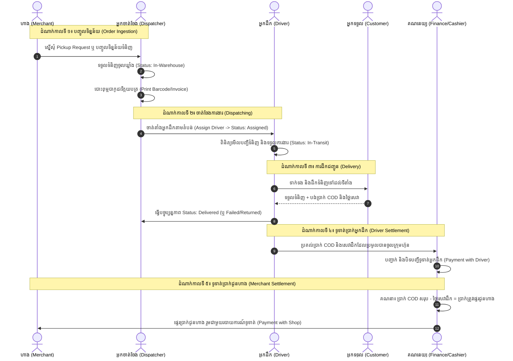

# សៀវភៅណែនាំអ្នកប្រើប្រាស់ និងលំហូរដំណើរការប្រព័ន្ធ
# Delivery Management System (User Guideline & Process Flow)

---

## មាតិកា (Table of Contents)
1. [ទិដ្ឋភាពទូទៅនៃប្រព័ន្ធ (System Overview)](#1-ទិដ្ឋភាពទូទៅនៃប្រព័ន្ធ-system-overview)
2. [តួនាទីអ្នកប្រើប្រាស់ និងការកំណត់សិទ្ធិ (User Roles & Permissions)](#2-តួនាទីអ្នកប្រើប្រាស់-user-roles)
3. [លំហូរដំណើរការប្រព័ន្ធទាំងមូល (End-to-End Process Flow)](#3-លំហូរដំណើរការប្រព័ន្ធទាំងមូល-process-flow)
4. [សៀវភៅណែនាំតាមដំណាក់កាលនីមួយៗ (Step-by-Step Operations)](#4-សៀវភៅណែនាំតាមដំណាក់កាលនីមួយៗ)
   - [ក. ការកំណត់ប្រព័ន្ធដំបូង (Initial Settings)](#ក-ការកំណត់ប្រព័ន្ធដំបូង-initial-settings)
   - [ខ. ការគ្រប់គ្រងហាងដៃគូ (Merchant Management)](#ខ-ការគ្រប់គ្រងហាងដៃគូ-merchant-management)
   - [គ. ការបញ្ចូលទិន្នន័យទំនិញ (Order Entry)](#គ-ការបញ្ចូលទិន្នន័យទំនិញ-order-entry)
   - [ឃ. ការបោះពុម្ពវិក្កយបត្រ និងស្លាកបាកូដ (Print Invoices & Labels)](#ឃ-ការបោះពុម្ពវិក្កយបត្រ-print-invoices)
   - [ង. ការចាត់ចែងអ្នកដឹកជញ្ជូន (Assign Delivery)](#ង-ការចាត់ចែងអ្នកដឹកជញ្ជូន-assign-delivery)
   - [ច. ប្រតិបត្តិការដឹកជញ្ជូនជាក់ស្តែង (In-Transit & Driver Execution)](#ច-ប្រតិបត្តិការដឹកជញ្ជូនជាក់ស្តែង-driver-execution)
   - [ឆ. ការទូទាត់ប្រាក់ និងគណនេយ្យ (Financial Settlement & Accounting)](#ឆ-ការទូទាត់ប្រាក់-financial-settlement)
   - [ជ. របាយការណ៍ និងការតាមដាន (Reports & Tracking)](#ជ-របាយការណ៍-reports--tracking)
5. [ករណីលើកលែង និងការដោះស្រាយបញ្ហា (Exception Handling & FAQ)](#5-ករណីលើកលែង-exception-handling)

---

## 1. ទិដ្ឋភាពទូទៅនៃប្រព័ន្ធ (System Overview)

ប្រព័ន្ធ **Delivery Management System** ត្រូវបានរៀបចំឡើងជាវេទិកា Multi-tenant SaaS សម្រាប់គ្រប់គ្រងខ្សែច្រវាក់ផ្គត់ផ្គង់ និងដឹកជញ្ជូនទំនិញ (Logistics & Last-Mile Delivery)។ ប្រព័ន្ធតភ្ជាប់គ្រប់ភាគីពាក់ព័ន្ធទាំងអស់ឱ្យដំណើរការលើទិន្នន័យ Real-time តែមួយ៖
- **ក្រុមហ៊ុនដឹកជញ្ជូន (Company/Branch)**: គ្រប់គ្រងឃ្លាំង ចាត់ចែងអ្នកដឹក តាមដានចំណូលចំណាយ
- **ហាងលក់ទំនិញ (Merchants)**: បញ្ចូលកញ្ចប់ទំនិញ ស្នើសុំឱ្យទៅយកទំនិញ តាមដានប្រាក់ COD
- **អ្នកដឹកជញ្ជូន (Drivers)**: ទទួលបញ្ជីទំនិញ ដឹកជញ្ជូនជូនភ្ញៀវ ប្រមូលប្រាក់ COD
- **អតិថិជនចុងក្រោយ (End Receivers)**: តាមដានទំនិញតាមរយៈលេខកូដ Tracking

---

## 2. តួនាទីអ្នកប្រើប្រាស់ (User Roles)

| តួនាទី (Role) | ភារកិច្ច និងសិទ្ធិអនុញ្ញាត |
|---|---|
| **Super Admin (SaaS)** | គ្រប់គ្រងក្រុមហ៊ុន/Tenant, កញ្ចប់ Subscription (Billing & Plans), ហេដ្ឋារចនាសម្ព័ន្ធ Cloud |
| **Admin / Manager** | គ្រប់គ្រងបុគ្គលិក, កំណត់ថ្លៃសេវាដឹក (Zone Type), មើលរបាយការណ៍ហិរញ្ញវត្ថុ, កំណត់សិទ្ធិ និង Telegram Bot |
| **Dispatcher / Operator** | បញ្ចូលទិន្នន័យទំនិញ, ទទួលទំនិញចូលឃ្លាំង, បោះពុម្ពវិក្កយបត្រ/បាកូដ, ចាត់តាំងអ្នកដឹក (Assign) |
| **Cashier / Accountant** | ទូទាត់ប្រាក់ COD ជាមួយអ្នកដឹក, ទូទាត់ប្រាក់ជូនហាង, កត់ត្រាចំណូល-ចំណាយទូទៅ (Income/Expense) |
| **Driver (អ្នកដឹកជញ្ជូន)** | មើលកញ្ចប់ទំនិញដែលបានចាត់តាំង, ធ្វើបច្ចុប្បន្នភាពស្ថានភាព (Delivered, Failed), ប្រមូលប្រាក់ COD |
| **Merchant (ម្ចាស់ហាង)** | បញ្ចូលកញ្ចប់ផ្ញើ, ស្នើសុំ Pickup Request, ពិនិត្យមើលរបាយការណ៍ទូទាត់ប្រាក់ |

---

## 3. លំហូរដំណើរការប្រព័ន្ធទាំងមូល (Process Flow)

### ដ្យាក្រាមលំហូរការងារពីដើមដល់ចប់ (End-to-End Workflow Diagram)

### វដ្តជីវិតនៃស្ថានភាពកញ្ចប់ទំនិញ (Parcel Status Lifecycle)

- **Pending**: ទំនិញទើបបង្កើត មិនទាន់ចូលឃ្លាំង
- **In-Warehouse**: ទំនិញបានមកដល់ឃ្លាំង ត្រៀមរៀបចំ
- **Assigned**: បានចាត់តាំងឱ្យអ្នកដឹកជញ្ជូន
- **Picked-Up / In-Transit**: អ្នកដឹកកំពុងធ្វើដំណើរទៅដឹកជូនភ្ញៀវ
- **Delivered**: បានដឹកជោគជ័យ និងប្រមូលប្រាក់រួចរាល់
- **Failed**: ដឹកមិនជោគជ័យ (ភ្ញៀវមិនលើកទូរស័ព្ទ, សុំពន្យារពេល, ឬប្តូរចិត្ត)
- **Returned**: ទំនិញត្រូវបង្វិលសងត្រឡប់ទៅហាងវិញ
- **Cancelled**: ការកុម្ម៉ង់ត្រូវបានលុបចោល

---

## 4. សៀវភៅណែនាំតាមដំណាក់កាលនីមួយៗ

### ក. ការកំណត់ប្រព័ន្ធដំបូង (Initial Settings)
មុននឹងចាប់ផ្តើមប្រតិបត្តិការ ត្រូវរៀបចំការកំណត់មូលដ្ឋានជាមុន៖
1. **តំបន់ប្រតិបត្តិការដឹកជញ្ជូន (Settings ➔ Zone Type)**:
   - បង្កើតឈ្មោះតំបន់ (ឧទាហរណ៍៖ ភ្នំពេញកណ្តាល, តំបន់ជាយក្រុង, បណ្តាខេត្ត)
   - កំណត់តម្លៃសេវាដឹកគោល (Base Delivery Fee)
   - បន្ថែមប្រភេទតំបន់រង (Subzones) ដូចជា ខណ្ឌ/ស្រុក ឬសង្កាត់/ឃុំ
2. **គ្រប់គ្រងបុគ្គលិក (Staff ➔ List Staff)**:
   - បង្កើតគណនីបុគ្គលិកតាមតួនាទី (Admin, Dispatcher, Driver, Cashier)
   - បញ្ចូលឈ្មោះ លេខទូរស័ព្ទ អ៊ីម៉ែល តួនាទី ប្រាក់ខែ និងកាលបរិច្ឆេទចូលធ្វើការ
3. **យានយន្ត (Staff ➔ Vehicles)**:
   - បញ្ចូលព័ត៌មានម៉ូតូ ឬរថយន្ត លេខស្លាកលេខ និងភ្ជាប់ជាមួយអ្នកដឹក
4. **ការកំណត់ Telegram (Settings ➔ Telegram Settings)**:
   - ភ្ជាប់ Telegram Bot Token និង Chat ID ដើម្បីទទួលបានដំណឹង Notification ស្វ័យប្រវត្តិពេលមាន Order ថ្មី ឬពេលដឹកចប់

---

### ខ. ការគ្រប់គ្រងហាងដៃគូ (Merchant Management)
- **ទីតាំងម៉ឺនុយ**: `Manage Shops ➔ Shop List`
- **ការបង្កើតហាងថ្មី**:
  1. ចុចប៊ូតុង **"Add Shop / បន្ថែមហាង"**
  2. បញ្ចូលឈ្មោះហាង (ឈ្មោះខ្មែរ/អង់គ្លេស) លេខទូរស័ព្ទ Telegram Username/Link
  3. បញ្ចូលទីតាំង Google Maps និងអាសយដ្ឋានហាង
  4. កំណត់កម្រៃសេវាពិសេស (Pricing Tier / Special Delivery Fee) ប្រសិនបើហាងមានកិច្ចសន្យាតម្លៃពិសេស
  5. ដាក់ព័ត៌មានគណនីធនាគារ (ABA/Acleda) សម្រាប់ងាយស្រួលផ្ទេរប្រាក់ COD ជូនហាង

---

### គ. ការបញ្ចូលទិន្នន័យទំនិញ (Order Entry)
មាន ២ ជម្រើសក្នុងការបញ្ចូលទិន្នន័យ៖

#### ជម្រើសទី ១៖ បញ្ចូលទិន្នន័យច្រើនក្នុងពេលតែមួយ (Batch Entry Data)
- **ទីតាំងម៉ឺនុយ**: `Manage Delivery ➔ Batch Entry Data`
- **ជំហានអនុវត្ត**:
  1. ជ្រើសរើសឈ្មោះហាងផ្ញើ (Merchant)
  2. បញ្ចូលជួរទិន្នន័យនីមួយៗ៖
     - ឈ្មោះ និងលេខទូរស័ព្ទអ្នកទទួល
     - អាសយដ្ឋាន និងតំបន់ (Zone / Subzone)
     - តម្លៃទំនិញដែលត្រូវទារពីភ្ញៀវ (COD Amount)
     - តម្លៃសេវាដឹក (Delivery Fee - គណនាស្វ័យប្រវត្តិតាម Zone ឬកែប្រែដោយដៃ)
     - អ្នកចេញថ្លៃសេវាដឹក (Shop បង់ ឬ Receiver បង់)
  3. ចុច **Save / រក្សាទុក** ទាំងអស់។ ប្រព័ន្ធនឹងបង្កើត Tracking Code ដោយស្វ័យប្រវត្តិ។

#### ជម្រើសទី ២៖ ហាងស្នើសុំមកយកទំនិញ (Pickup Requests)
- ហាងបង្កើតសំណើ Pickup តាមរយៈប្រព័ន្ធ
- អ្នកចាត់ចែងចូលមើល `Manage Delivery ➔ Pickup Requests` រួចចុច Accept និងចាត់តាំងអ្នកដឹកទៅទទួលទំនិញពីហាង។

---

### ឃ. ការបោះពុម្ពវិក្កយបត្រ និងស្លាកបាកូដ (Print Invoices & Labels)
- **ទីតាំងម៉ឺនុយ**: `Manage Delivery ➔ Print Invoice Delivery`
- **ជំហានអនុវត្ត**:
  1. ជ្រើសរើសកញ្ចប់ទំនិញដែលចង់បោះពុម្ព (អាចជ្រើសទាំងអស់ ឬជ្រើសរើសតាមហាង)
  2. ជ្រើសរើសទម្រង់បោះពុម្ព៖
     - **Invoice Print**: វិក្កយបត្របញ្ជាក់ការដឹកជញ្ជូនខ្នាត A4/A5 ជូនអតិថិជន
     - **Thermal Label / Sticker**: ស្ទីគ័របិទលើកញ្ចប់ទំនិញដែលមាន QR Code, Tracking Code, ឈ្មោះ និងលេខទូរស័ព្ទ
  3. បិទស្លាកបាកូដលើកញ្ចប់ទំនិញ រួចរៀបចំដាក់តាមប្រអប់ ឬតំបន់។

---

### ង. ការចាត់ចែងអ្នកដឹកជញ្ជូន (Assign Delivery)
- **ទីតាំងម៉ឺនុយ**: `Manage Delivery ➔ Process For Assign`
- **ជំហានអនុវត្ត**:
  1. ត្រួតពិនិត្យបញ្ជីទំនិញដែលនៅក្នុងឃ្លាំង (In-Warehouse)
  2. ជ្រើសរើសទំនិញតាមតំបន់ (Zone) ឬផ្លូវដឹក
  3. ជ្រើសរើសឈ្មោះអ្នកដឹកជញ្ជូន (Driver)
  4. ចុច **"Assign Delivery"**
  - កញ្ចប់ទំនិញនឹងប្តូរស្ថានភាពទៅជា **Assigned** ហើយបង្ហាញនៅលើទូរស័ព្ទដៃរបស់អ្នកដឹកជញ្ជូនភ្លាមៗ។

---

### ច. ប្រតិបត្តិការដឹកជញ្ជូនជាក់ស្តែង (Driver Execution)
1. **ទទួលការងារ**: អ្នកដឹកបើកមើលទំព័រការងារផ្ទាល់ខ្លួន មើលបញ្ជីទំនិញ លេខទូរស័ព្ទ និងទីតាំងអ្នកទទួល។
2. **ទាក់ទងភ្ញៀវ**: ទូរស័ព្ទទៅកាន់ភ្ញៀវមុនពេលចេញដំណើរ។
3. **ប្រគល់ទំនិញ និងប្រមូលប្រាក់**:
   - ប្រគល់កញ្ចប់ទំនិញ
   - ប្រមូលប្រាក់ COD + ថ្លៃដឹក (ប្រសិនបើភ្ញៀវជាអ្នកបង់)
4. **ធ្វើបច្ចុប្បន្នភាពស្ថានភាព**:
   - **Delivered**: ដឹកចប់ជោគជ័យ
   - **Failed**: បរាជ័យ (បញ្ជាក់មូលហេតុ៖ ទាក់ទងមិនបាន, សុំពន្យារពេល, ឬបដិសេធមិនយក)

---

### ឆ. ការទូទាត់ប្រាក់ និងគណនេយ្យ (Financial Settlement)

#### ១. ទូទាត់ជាមួយអ្នកដឹក (Payment with Delivery)
- **ទីតាំងម៉ឺនុយ**: `Payment Process ➔ Payment with Delivery`
- **គោលបំណង**: ប្រមូលប្រាក់ដែលអ្នកដឹកបានកាន់ពីការប្រមូល COD និងថ្លៃសេវាដឹកក្នុងមួយថ្ងៃ
- **ជំហានអនុវត្ត**:
  1. ជ្រើសរើសឈ្មោះអ្នកដឹកជញ្ជូន
  2. ពិនិត្យផ្ទៀងផ្ទាត់ចំនួនកញ្ចប់ទំនិញដែលបានដឹក Delivered
  3. ផ្ទៀងផ្ទាត់ចំនួនទឹកប្រាក់ជាក់ស្តែងដែលអ្នកដឹកប្រគល់ចូលតុគណនេយ្យ
  4. ចុច **"Confirm Payment / បញ្ជាក់ការទូទាត់"** ដើម្បីបិទបញ្ជី។

#### ២. ទូទាត់ជាមួយហាង (Payment with Shop)
- **ទីតាំងម៉ឺនុយ**: `Payment Process ➔ Payment with Shop`
- **គោលបំណង**: ផ្ទេរប្រាក់ថ្លៃទំនិញត្រឡប់ទៅហាងវិញ
- **រូបមន្តគណនា**:
  $$\text{ទឹកប្រាក់ត្រូវផ្ទេរជូនហាង} = \text{ប្រាក់ COD សរុប} - \text{ថ្លៃសេវាដឹកជញ្ជូន}$$
- **ជំហានអនុវត្ត**:
  1. ជ្រើសរើសហាងដែលត្រូវទូទាត់
  2. ពិនិត្យបញ្ជីទំនិញដែលបាន Delivered
  3. ផ្ទេរប្រាក់តាមគណនីធនាគាររបស់ហាង (ABA/Acleda)
  4. ចុច **"Settle / ទូទាត់"** និងទាញយកវិក្កយបត្រទូទាត់ (Settlement Statement) ផ្ញើជូនហាង។

#### ៣. គ្រប់គ្រងចំណូល-ចំណាយទូទៅ (Accounting)
- កត់ត្រាចំណាយប្រតិបត្តិការនៅ `Accounting ➔ Expense List` (សាំង, ជួសជុល, ថ្លៃជួល...)
- កត់ត្រាចំណូលផ្សេងៗនៅ `Accounting ➔ Income List`។

---

### ជ. របាយការណ៍ និងការតាមដាន (Reports & Tracking)

1. **Dashboard**: មើលសូចនាករគន្លឹះ (KPIs) ចំនួនកញ្ចប់សរុប ចំណូលសរុប និងក្រាហ្វប្រៀបធៀប។
2. **Live Fleet Map (`/delivery/live-map`)**: មើលទីតាំងភូមិសាស្ត្ររបស់អ្នកដឹក និងកញ្ចប់ទំនិញលើផែនទីជាក់ស្តែង។
3. **Summary Reports**:
   - **Shop Summary**: ប្រតិបត្តិការតាមហាងនីមួយៗ
   - **Delivery Summary**: ការងាររបស់អ្នកដឹកម្នាក់ៗ
   - **Pickup Summary**: ការចុះយកទំនិញ
4. **Public Tracking (`/tracking`)**: ភ្ញៀវវាយបញ្ចូលលេខ Tracking Code ដើម្បីដឹងថាទំនិញកំពុងនៅទីណា។

---

## 5. ករណីលើកលែង និងការដោះស្រាយបញ្ហា (Exception Handling & FAQ)

### Q1: អតិថិជនសុំពន្យារពេលទទួលទំនិញ (Reschedule Delivery)?
- អ្នកដឹក ឬ Dispatcher ត្រូវដាក់ស្ថានភាពជា **Failed** រួចជ្រើសរើសមូលហេតុ "Rescheduled / ពន្យារពេល"។
- កញ្ចប់ទំនិញនឹងត្រូវយកមករក្សាទុកក្នុងឃ្លាំងវិញ ដើម្បីត្រៀមចាត់ចែងដឹកនៅថ្ងៃបន្ទាប់។

### Q2: អតិថិជនបដិសេធមិនយកទំនិញ (Customer Rejected / Return)?
- ធ្វើបច្ចុប្បន្នភាពស្ថានភាពទៅជា **Returned**។
- កញ្ចប់ទំនិញនឹងត្រូវកត់ត្រាចូលក្នុងបញ្ជីទំនិញត្រូវប្រគល់សងហាងវិញ។
- ប្រព័ន្ធនឹងមិនបូកបញ្ចូលប្រាក់ COD ឡើយ ប៉ុន្តែអាចគិតថ្លៃសេវាដឹកត្រឡប់ទៅតាមគោលការណ៍របស់ក្រុមហ៊ុន។

### Q3: ហាងចង់ដឹងថាទំនិញណាខ្លះមិនទាន់ទូទាត់លុយ?
- ចូលទៅកាន់ `Payment Process ➔ Payment with Shop` ជ្រើសរើស Filter: **Unpaid**។

---
*ឯកសារនេះត្រូវបានរៀបចំឡើងសម្រាប់ Delivery Management System ។ អាចកែសម្រួលបន្ថែមស្របតាមគោលការណ៍ប្រតិបត្តិការជាក់ស្តែងរបស់ក្រុមហ៊ុន។*
